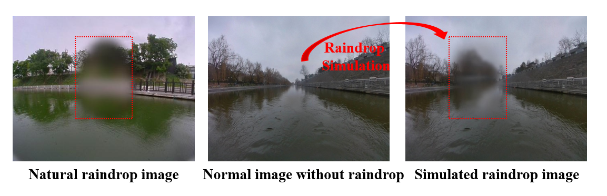

# Raindrop segmentation datasets
This open access dataset is publicly available for USVs raindrop segmentation task, along with our paper work "Panoptic Monocular Visual Perception on water surface for Unmanned Surface Vehicles". 

## Introduction
The dataset, collected by our USV platform was collected in real-world water surface scenes under rainy days. The collected images have a resolution of 640 × 480. Thanks to the excellent simulation method [1], we generate simulated raindrop segmentation data with collected normal images. The raindrop segmentation dataset consists of a training set with 20K images and a test set with 5K images. 

## datasets link
Coming soon ...

## How to use
The dataset is made into VOC style, and is clustered to training, validation and test by 6:2:2. The dataset structure is shown as follow:

- Scene 1
  - ImageSets
      - test.txt
      - val.txt
      - train.txt

  - JPEGImages
    - 00001.jpg
    - 00002.jpg

  - SegmentationClass
    - seq1_0000.png
    - seq1_0001.png

 - Scene 2
   - ImageSets
   - JPEGImages
   - SegmentationClass
 - Scene N

## Datasample
The sample of our dataset is as illustrated. The left image is natural collected image with raindrop obstruction. The middle image is natural collected image without raindrop obstruction. The right image is simulated raindrop image.

</figure> 

## Reference
[1] Soboleva V, Shipitko O. Raindrops on windshield: Dataset and lightweight gradient-based detection algorithm[C]//2021 IEEE Symposium Series on Computational Intelligence (SSCI). IEEE, 2021: 1-7.
